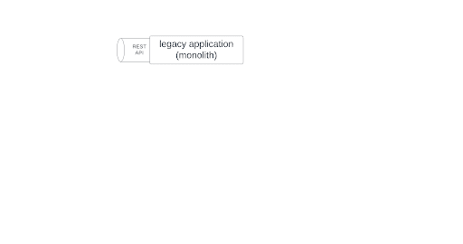
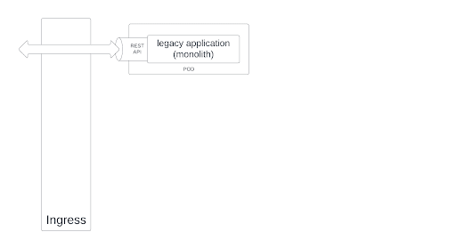
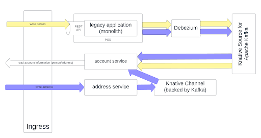
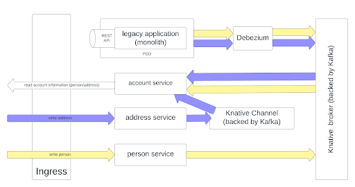
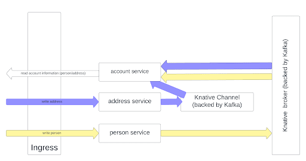
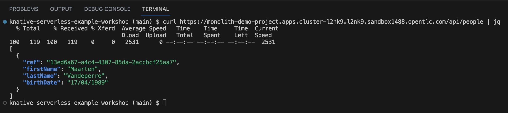
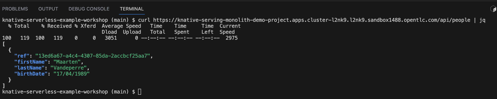

# Decompose the monolith
## 1. Outline
### 1.1. Initial setup: the monolith


### 1.2. Containerize the monolith


### 1.3. Extract account service


### 1.4. Extract address service


### 1.5. Extract person service


### 1.6. Kill the monolith


## 2. Step by step execution

**!!! All following commands should be executed from within the dev spaces workspace in 
the root of the project !!!**

### 2.1. Create Postgres database
```shell
oc new-app \
  -e POSTGRES_USER=postgres \
  -e POSTGRES_PASSWORD=postgres \
  -e POSTGRES_DB=knative_demo \
  -e PGDATA=/tmp/data/pgdata \
  quay.io/appdev_playground/wal_postgres:0.0.2 \
  --name postgres
```

And add initial data (**!!! replace the pod name in the following example with the pod name of the Postgres pod. You can find it with the ```oc get pod``` command**).
```shell
oc exec -it postgres-7b5478878b-tr9hw -- mkdir /tmp/init-scripts
oc rsync ./db-init-scripts/postgres postgres-7b5478878b-tr9hw:/tmp/init-scripts
oc exec -it postgres-7b5478878b-tr9hw -- psql -U postgres -d knative_demo -a -f /tmp/init-scripts/postgres/001_setup_addresses_table.sql
oc exec -it postgres-7b5478878b-tr9hw -- psql -U postgres -d knative_demo -a -f /tmp/init-scripts/postgres/002_setup_person_table.sql
oc exec -it postgres-7b5478878b-tr9hw -- psql -U postgres -d knative_demo -a -f /tmp/init-scripts/postgres/003_add_outbox_tables.sql

or:

oc exec -it $(oc get pod -o custom-columns=POD:.metadata.name --no-headers | grep postgres) -- mkdir /tmp/init-scripts
oc rsync ./db-init-scripts/postgres $(oc get pod -o custom-columns=POD:.metadata.name --no-headers | grep postgres):/tmp/init-scripts
oc exec -it $(oc get pod -o custom-columns=POD:.metadata.name --no-headers | grep postgres) -- psql -U postgres -d knative_demo -a -f /tmp/init-scripts/postgres/001_setup_addresses_table.sql
oc exec -it $(oc get pod -o custom-columns=POD:.metadata.name --no-headers | grep postgres) -- psql -U postgres -d knative_demo -a -f /tmp/init-scripts/postgres/002_setup_person_table.sql
oc exec -it $(oc get pod -o custom-columns=POD:.metadata.name --no-headers | grep postgres) -- psql -U postgres -d knative_demo -a -f /tmp/init-scripts/postgres/003_add_outbox_tables.sql
```

### 2.2. Create MongoDB database
```shell
oc new-app \
  -e MONGO_INITDB_ROOT_USERNAME=mongo \
  -e MONGO_INITDB_ROOT_PASSWORD=mongo \
  mongo:4.2.24 \
  --name knative-mongo
```

## 2.3. Deploy the monolith with basic deployment configuration
```shell
sh tutorial/scripts/02_script.sh
```
In order to validate if it ran successfully, you can check the output of the monolith route


## 2.4. Deploy the monolith with OpenShift Serverless - serving
```shell
sh tutorial/scripts/03_script.sh
```
In order to validate if it ran successfully, you can check the output of the monolith route


## WIP: 2.5. Deploy the account microservice with OpenShift Serverless - serving
And sync with Debezium
```shell
sh tutorial/scripts/04a_script.sh
sh tutorial/scripts/04b_script.sh
```
In order to validate if it ran successfully, you can check the output of the monolith route

https://knative-service-microservice-account-demo-project.apps.cluster-l2nk9.l2nk9.sandbox1488.opentlc.com/api/accounts