# Decompose the monolith
## 1. Outline
### 1.1. Initial setup: the monolith


### 1.2. Containerize the monolith


### 1.3. Extract account service


### 1.4. Extract address service


### 1.5. Extract person service


### 1.6. Kill the monolith


## 2. Step by step execution

**!!! All following commands should be executed from within the dev spaces workspace in 
the root of the project !!!**

### 2.1. Create Postgres database
```shell
oc new-app \
  -e POSTGRES_USER=postgres \
  -e POSTGRES_PASSWORD=postgres \
  -e POSTGRES_DB=knative_demo \
  -e PGDATA=/tmp/data/pgdata \
  quay.io/appdev_playground/wal_postgres:0.0.2 \
  --name postgres
```

And add initial data (**!!! replace the pod name in the following example with the pod name of the Postgres pod. You can find it with the ```oc get pod``` command**).
```shell
execute them one by one!

oc exec -it postgres-7b5478878b-tr9hw -- mkdir /tmp/init-scripts
oc rsync ./db-init-scripts/postgres postgres-7b5478878b-tr9hw:/tmp/init-scripts
oc exec -it postgres-7b5478878b-tr9hw -- psql -U postgres -d knative_demo -a -f /tmp/init-scripts/postgres/001_setup_addresses_table.sql
oc exec -it postgres-7b5478878b-tr9hw -- psql -U postgres -d knative_demo -a -f /tmp/init-scripts/postgres/002_setup_person_table.sql
oc exec -it postgres-7b5478878b-tr9hw -- psql -U postgres -d knative_demo -a -f /tmp/init-scripts/postgres/003_add_outbox_tables.sql

or (execute them one by one!):

oc exec -it $(oc get pod -o custom-columns=POD:.metadata.name --no-headers | grep postgres) -- mkdir /tmp/init-scripts
oc rsync ./db-init-scripts/postgres $(oc get pod -o custom-columns=POD:.metadata.name --no-headers | grep postgres):/tmp/init-scripts
oc exec -it $(oc get pod -o custom-columns=POD:.metadata.name --no-headers | grep postgres) -- psql -U postgres -d knative_demo -a -f /tmp/init-scripts/postgres/001_setup_addresses_table.sql
oc exec -it $(oc get pod -o custom-columns=POD:.metadata.name --no-headers | grep postgres) -- psql -U postgres -d knative_demo -a -f /tmp/init-scripts/postgres/002_setup_person_table.sql
oc exec -it $(oc get pod -o custom-columns=POD:.metadata.name --no-headers | grep postgres) -- psql -U postgres -d knative_demo -a -f /tmp/init-scripts/postgres/003_add_outbox_tables.sql
```

### 2.2. Create MongoDB database
```shell
oc new-app \
  -e MONGO_INITDB_ROOT_USERNAME=mongo \
  -e MONGO_INITDB_ROOT_PASSWORD=mongo \
  mongo:4.2.24 \
  --name knative-mongo
```

## 2.3. Deploy the monolith with basic deployment configuration
```shell
sh tutorial/scripts/02_script.sh
```
In order to validate if it ran successfully, you can check the output of the monolith route
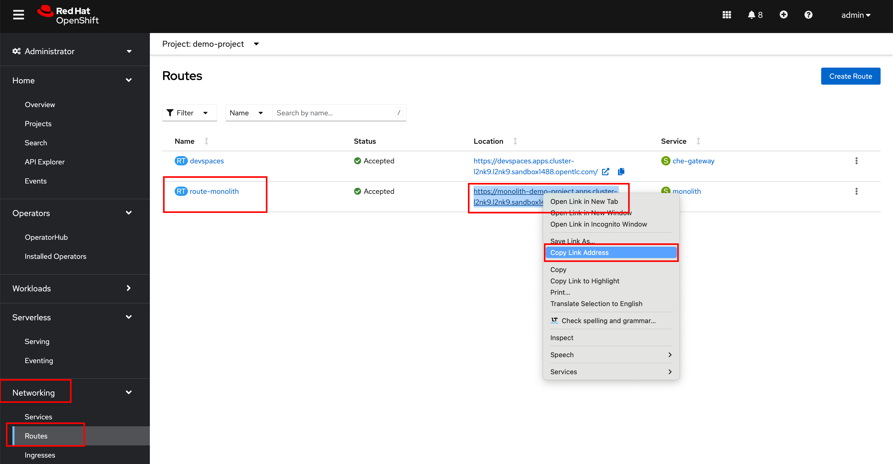


## 2.4. Deploy the monolith with OpenShift Serverless - serving
```shell
sh tutorial/scripts/03_script.sh
```
In order to validate if it ran successfully, you can check the output of the monolith serving route
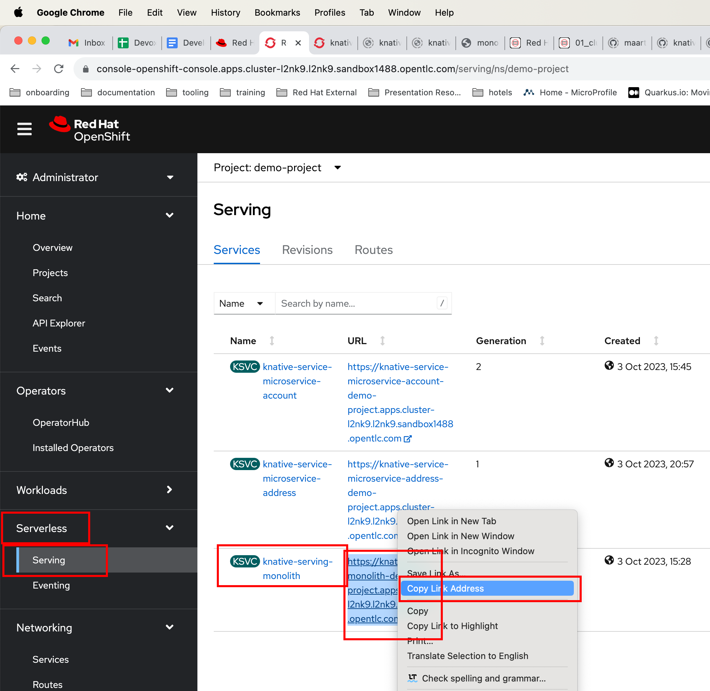


## 2.5. Deploy the account microservice with OpenShift Serverless - serving & Source to sink config
Within this step, we will extract the account logic (i.e., account microservice) from the monolith. Whenever changes are happening
on the monolith, Debezium will detect them and add them to a Kafka topic. There will be a source to sink configuration in place,
which will trigger an account microservice data sync when such a message is put on the topic.
```shell
sh tutorial/scripts/04a_script.sh
sh tutorial/scripts/04b_script.sh
```
In order to validate if it ran successfully, run following validation checks
1. Check response from account service
    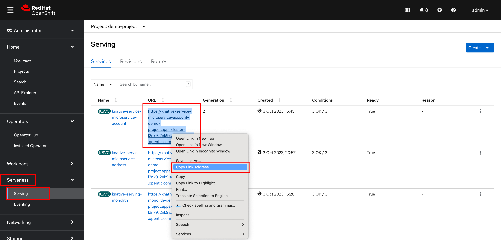
    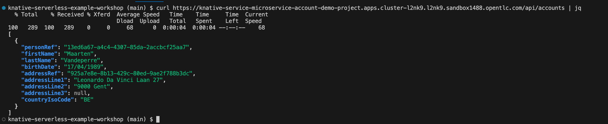
2. Open a Kafka consumer to check if messages are generated when the monolith's person or address
data changes (i.e., insert, update or delete). !!! Be aware, if you have a different project name,
you will have to change it in the bootstrap server url
    ```shell
    oc exec -it my-cluster-kafka-0 \
      -- bin/kafka-console-consumer.sh \
      --bootstrap-server my-cluster-kafka-bootstrap.demo-project.svc.cluster.local:9092 \
      --topic monolith_data_changed.public.people_changed
    ```
3. Execute a CURL call to add a person to the monolith:  !!! Be aware, if you have a different project name,
   you will have to change it in the bootstrap server url
    ```shell
    curl --location 'https://knative-serving-monolith-demo-project.apps.cluster-l2nk9.l2nk9.sandbox1488.opentlc.com/api/people' \
    --header 'Content-Type: application/json' \
    --header 'Cookie: 1d146a18013fc0b7dc188e8aab4d8b2e=4cba66d56c609e5f7167bd40296c17aa' \
    --data-raw '{
        "firstName": "Maarten @ Knative Demo",
        "lastName": "Vandeperre"
    }'
    ```
4. Quickly after the curl command, do a couple of ```oc get pod``` commands until you see 
a pod for the account service up-and-running (as it is serverless, it will be up-and-running for limited
amount of time):
    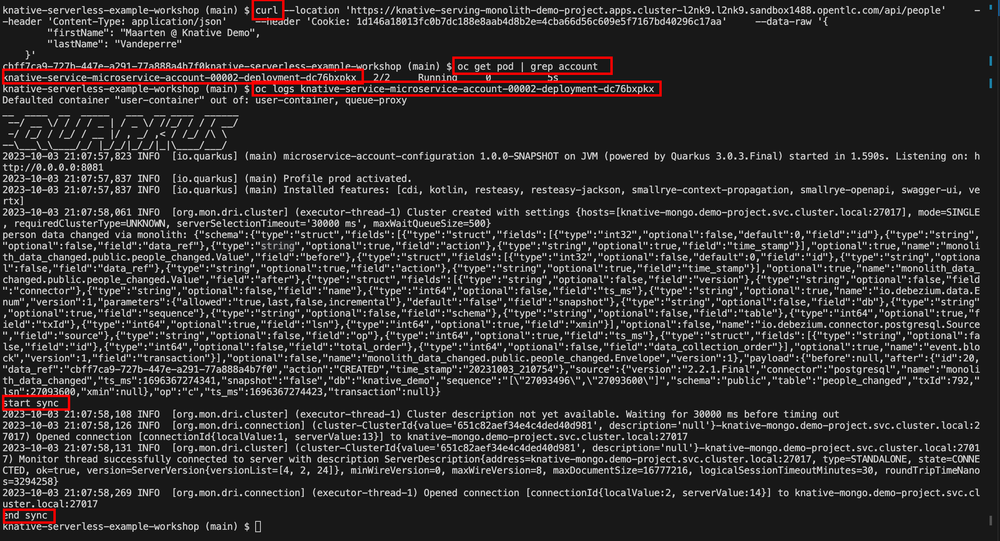
5. The consumer should receive a message, referring to the change.
   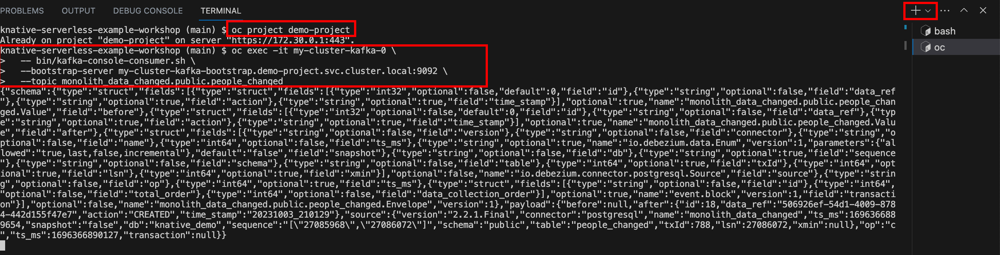


## 2.6. Deploy the address microservice with OpenShift Serverless - serving & Channel config
Within this step, we will extract the address logic (i.e., address microservice) from the monolith. 
Whenever changes are happening on this microservice, the account microservice will be synced via the 
serverless channel-subscription topology. You can check the code: WithChannelUpdateAddressRepository
```shell
sh tutorial/scripts/05_script.sh
```
In order to validate if it ran successfully, run following validation checks
1. Check response from the address microservice
   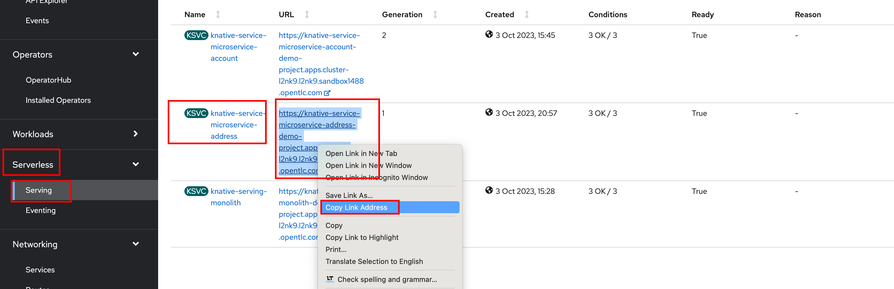
   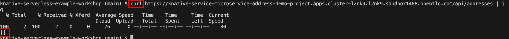
2. Create an address in the address microservice and keep the address UUID 
(we will link it to a person in a later stage). !!! Be aware, if you have a different project name,
   you will have to change it in the bootstrap server url
```shell
curl --location 'https://knative-service-microservice-address-demo-project.apps.cluster-l2nk9.l2nk9.sandbox1488.opentlc.com/api/addresses' \
--header 'Content-Type: application/json' \
--header 'Cookie: 69c9933e3ba539b1af7eb4375bdc36d0=abfe0f526bf00bb9f8436fdcbd23d641' \
--data '{
    "addressLine1": "Kinepolis",
    "addressLine2": "Antwerp",
    "countryIsoCode": "BE"
}'
```
(Don't forget to store the resulting UUID, "4f1ce413-ea9a-47eb-8e4a-ad81c89a2fed", in our case => see screenshot below).
3. Quickly after the curl command, do a couple of ```oc get pod``` commands until you see
   a pod for the account service up-and-running (as it is serverless, it will be up-and-running for limited
   amount of time):
   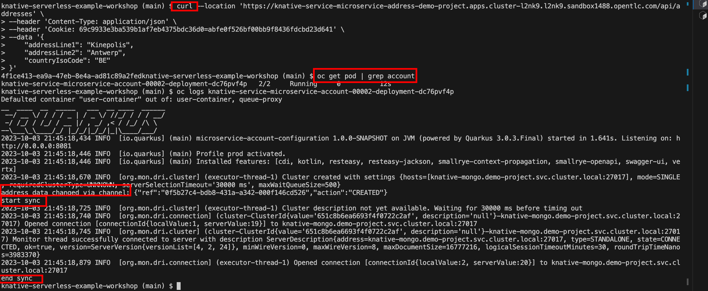


## 2.7. Deploy the person microservice with OpenShift Serverless - serving & Trigger - broker config
Within this step, we will extract the person logic (i.e., person microservice) from the monolith. 
Whenever changes are happening on this microservice, the account microservice will be synced via the 
serverless trigger-broker topology. You can check the code: WithChannelUpdatePersonRepository
```shell
sh tutorial/scripts/06_script.sh
```
In order to validate if it ran successfully, run following validation checks
1. Check response from the person microservice
   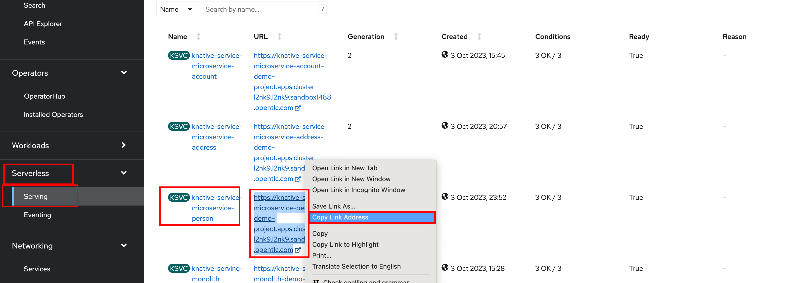
   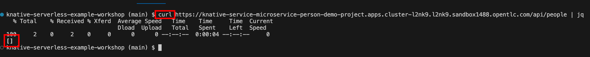
2. Create a person in the person microservice and use the address UUID from previous section. 
!!! Be aware, if you have a different project name,
   you will have to change it in the bootstrap server url
```shell
curl --location 'https://knative-service-microservice-person-demo-project.apps.cluster-l2nk9.l2nk9.sandbox1488.opentlc.com/api/people' \
--header 'Content-Type: application/json' \
--data-raw '{
    "firstName": "Maarten @ Knative Demo - With address",
    "lastName": "Vandeperre",
    "birthDate": "17/04/1989",
    "addressRef": "4f1ce413-ea9a-47eb-8e4a-ad81c89a2fed"
}'
```
3. Quickly after the curl command, do a couple of ```oc get pod``` commands until you see
   a pod for the account service up-and-running (as it is serverless, it will be up-and-running for limited
   amount of time):
   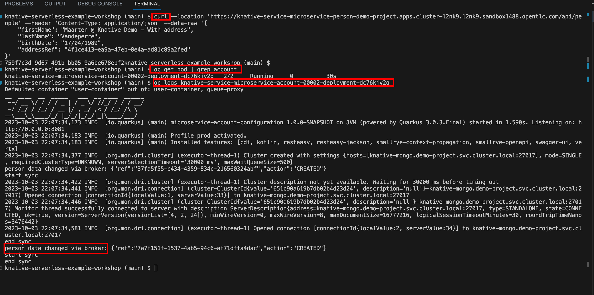
4. Now that we have a person entity linked to an address, we should be able to see the corresponding 
   account entity:
       ```shell
        curl https://knative-service-microservice-account-demo-project.apps.cluster-l2nk9.l2nk9.sandbox1488.opentlc.com/api/accounts | jq
       ```
      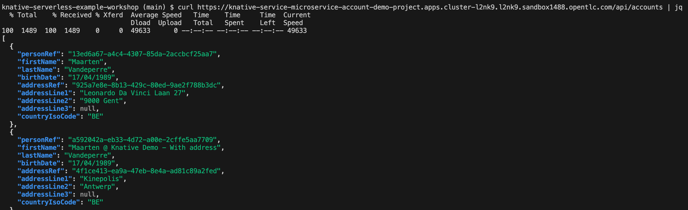

## 2.8. Kill the monolith!!