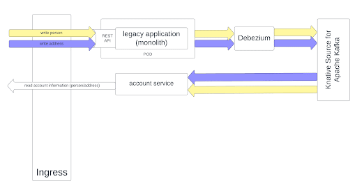

# Decompose the monolith
## 1. Outline
### 1.1. Initial setup: the monolith


### 1.2. Containerize the monolith


### 1.3. Extract account service


### 1.4. Extract address service


### 1.5. Extract person service


### 1.6. Kill the monolith


## 2. Step by step execution

**!!! All following commands should be executed from within the dev spaces workspace in 
the root of the project !!!**

### 2.1. Create Postgres database
```shell
oc new-app \
  -e POSTGRES_USER=postgres \
  -e POSTGRES_PASSWORD=postgres \
  -e POSTGRES_DB=knative_demo \
  -e PGDATA=/tmp/data/pgdata \
  quay.io/appdev_playground/wal_postgres:0.0.2 \
  --name postgres
```

And add initial data (**!!! replace the pod name in the following example with the pod name of the Postgres pod. You can find it with the ```oc get pod``` command**).
```shell
oc exec -it postgres-7b5478878b-tr9hw -- mkdir /tmp/init-scripts
oc rsync ./db-init-scripts/postgres postgres-7b5478878b-tr9hw:/tmp/init-scripts
oc exec -it postgres-7b5478878b-tr9hw -- psql -U postgres -d knative_demo -a -f /tmp/init-scripts/postgres/001_setup_addresses_table.sql
oc exec -it postgres-7b5478878b-tr9hw -- psql -U postgres -d knative_demo -a -f /tmp/init-scripts/postgres/002_setup_person_table.sql
oc exec -it postgres-7b5478878b-tr9hw -- psql -U postgres -d knative_demo -a -f /tmp/init-scripts/postgres/003_add_outbox_tables.sql
```

### 2.2. Create MongoDB database
```shell
oc new-app \
  -e MONGO_INITDB_ROOT_USERNAME=mongo \
  -e MONGO_INITDB_ROOT_PASSWORD=mongo \
  mongo:4.2.24 \
  --name knative-mongo
```

## 2.3. Deploy the monolith with basic deployment configuration
```shell
sh tutorial/scripts/02_script.sh
```

## 2.4. Deploy the monolith with OpenShift Serverless - serving
```shell
sh tutorial/scripts/03_script.sh
```

## Debug
```shell
oc get pod
```
```shell
oc port-forward knative-mongo-c9b4cf7f-pg5fw 27017:27017
```

## Showcase Debezium
```shell
curl --location 'https://knative-serving-monolith-demo-project.apps.cluster-8f4q9.8f4q9.sandbox1055.opentlc.com/api/people' \
--header 'Content-Type: application/json' \
--data-raw '{
    "firstName": "Maarten @ Monolith",
    "lastName": "Vandeperre",
    "birthDate": "17/04/1989",
    "addressRef": "4f1ce413-ea9a-47eb-8e4a-ad81c89a2fed"
}'
```
  
Check Mongo: person not in the person microservice database, but it is in the account person database. Hence, the CDC-pipeline worked.