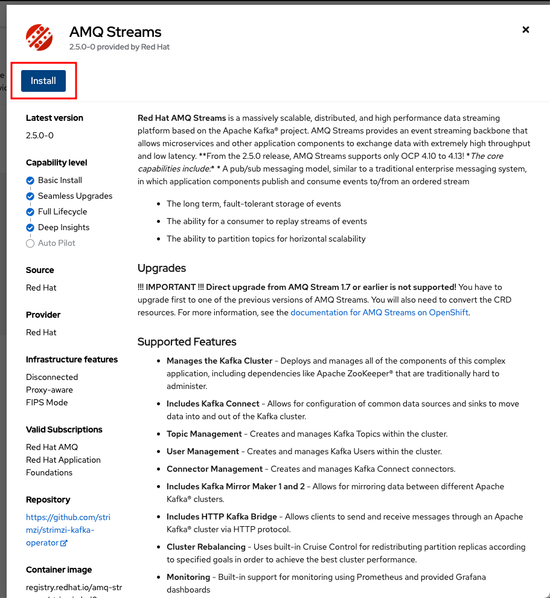

# Install and Configure the operators

1. [AMQ Streams - Kafka](#amq-streams---install-operator)
2. [Dev spaces](#dev-spaces---install-operator)
3. [OpenShift serverless - Knative](#openshift-serverless--knative----install-operator)

## AMQ Streams - Install Operator
1. Step 1  
    
2. Step 2  
   
3. Step 3 (Keep default configurations)  
   
4. Wait until the resources are provisioned and the operator is in a ready state (this can take some minutes).

## Dev Spaces - Install Operator
1. Step 1  
   
2. Step 2  
   
3. Step 3 (Keep default configurations)    
   

## OpenShift Serverless (Knative) - Install Operator
1. Step 1  
   
2. Step 2  
   
3. Step 3 (Keep default configurations)  
   
