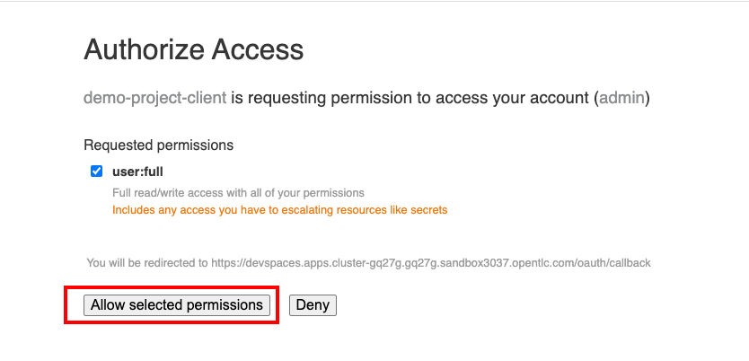
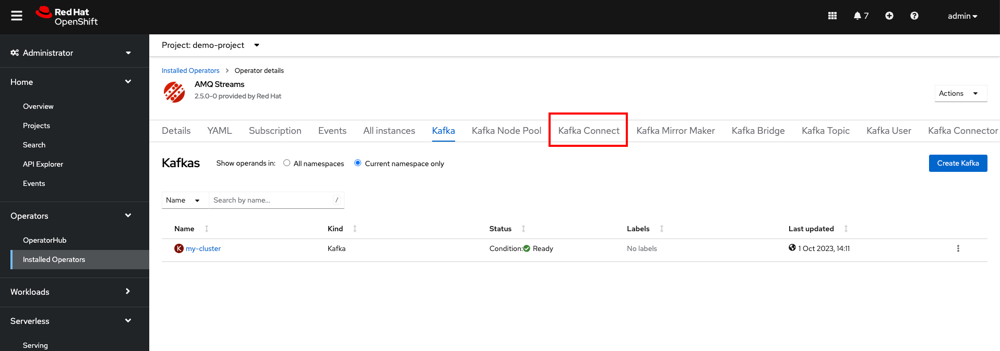

# Wrap up operator config

1. [Dev spaces](#dev-spaces)
2. [Metadata configuration](#metadata-configuration)
3. [AMQ Streams - Kafka](#amq-streams---kafka)
4. [OpenShift serverless - Knative](#openshift-serverless---knative)

## Dev spaces
1. Open specifications tab.  
   
  

2. Click "create Che cluster":  
   _A cloud development environment (CDE) service for OpenShift.
   Built on the open source Eclipse Che project, Red Hat OpenShift Dev Spaces uses Kubernetes and containers
   to provide developers and other IT team members with a consistent, secure, and zero-configuration development environment._
   
 

3. Create Che cluster with default settings.
   
 

4. Select the route for your OpenShift dev space. 
   
   Or
   
 

5. Click "Login with OpenShift".
   
 

6. Fill in login credentials.
   
 

7. Allow the selected permissions.
   
 

8. Link the current workshop GitHub repository (https://github.com/maarten-vandeperre/knative-serverless-example-workshop). 
   
 

9. Wait for the provisioning of the workspace.  
   
 

10. Open a terminal and start exploring. E.g.,  
      ```shell
      oc whoami
      ``` 
      ```shell
      oc get pod
      ``` 
      

## Metadata configuration
1. Change the content of the tutorial/scripts/.namespace file (in the dev spaces workspace) to your 
project name. _For us, it is "demo-project"_
2. Change the content of the tutorial/scripts/.root_domain file (in the dev spaces workspace) to your 
base domain from the OpenShift sandbox. _For us, it is "apps.cluster-gq27g.gq27g.sandbox3037.opentlc.com"_


## AMQ Streams - Kafka
1. Open Kafka tab.  
   


2. Click "create Kafka".
   
 

3. Click "create Kafka with default settings".  
   
  

4. Check for resources to be provisioned.
   
   

5. When all resources are available, the cluster status should reach the ready state.
   


6. Create the Kafka connect cluster (Debezium connector):  
   **!!! Make sure that you have configured the metadata as described in previous section !!!**  
   _Execute the following command in the terminal of the dev space, in the project root:_  
   ```shell
   sh tutorial/scripts/01_script.sh
   ```


7. Created Kafka Connect cluster should be visible in the UI.
   


## OpenShift serverless - Knative
1. Open "Knative Eventing" tab.  
   


2. Click "create Knative eventing".  
   **!!! This should be created in the "knative-eventing" namespace !!!**
   
 

3. Open "Knative Serving" tab.   
   
  

4. Click "create Knative serving".  
   **!!! This should be created in the "knative-serving" namespace !!!**
   
   

5. Create with default values.
   
   

6. When all resources are provisioned, you should be able to see the serverless section for all namespaces.  
   We'll check for our "demo-project" namespace.
   


7. Open "Knative Kafka" tab.  
   
   


8. Create the Knative Kafka cluster. !!! list all the brokers (from the namespaces) you want to use.  
   
   


   

